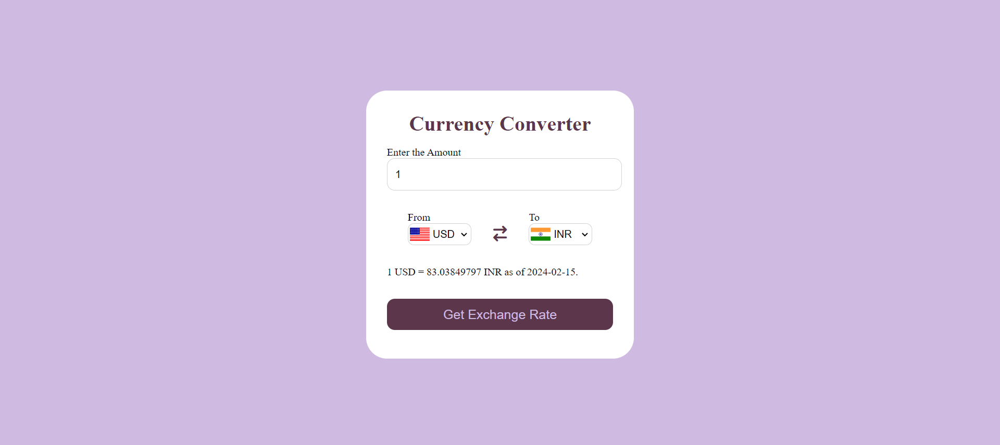
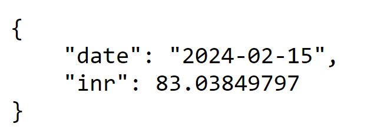
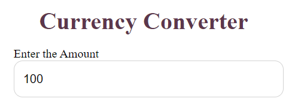
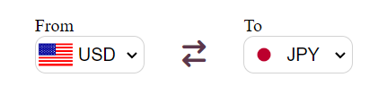
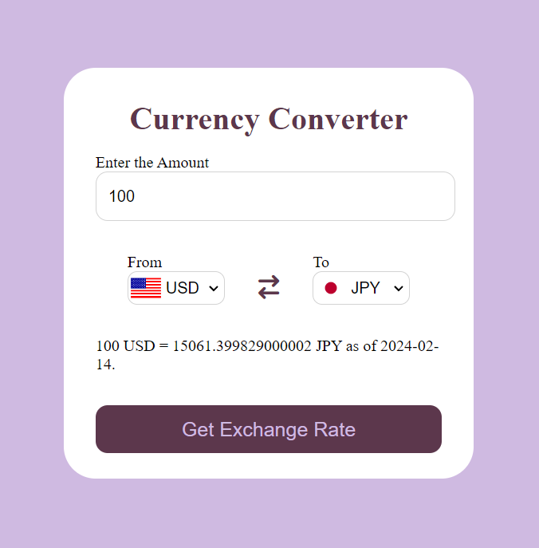
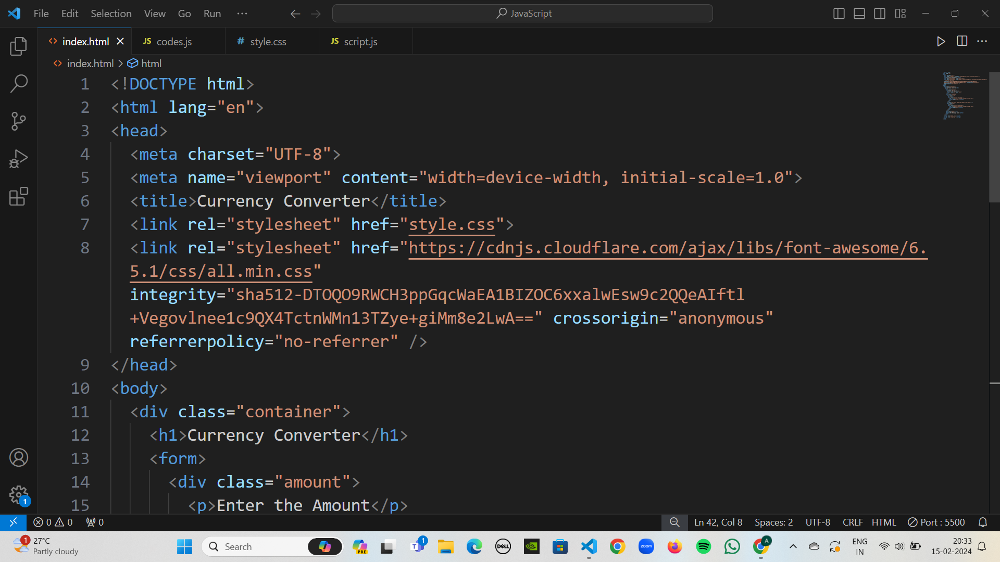
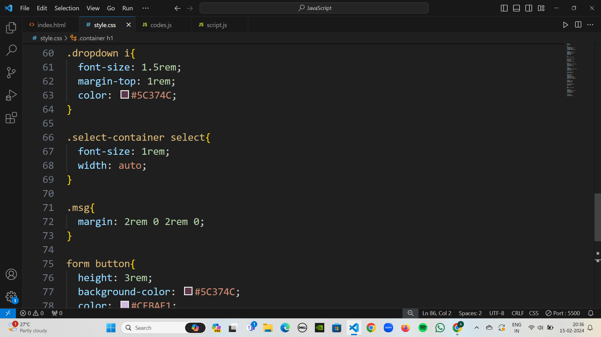
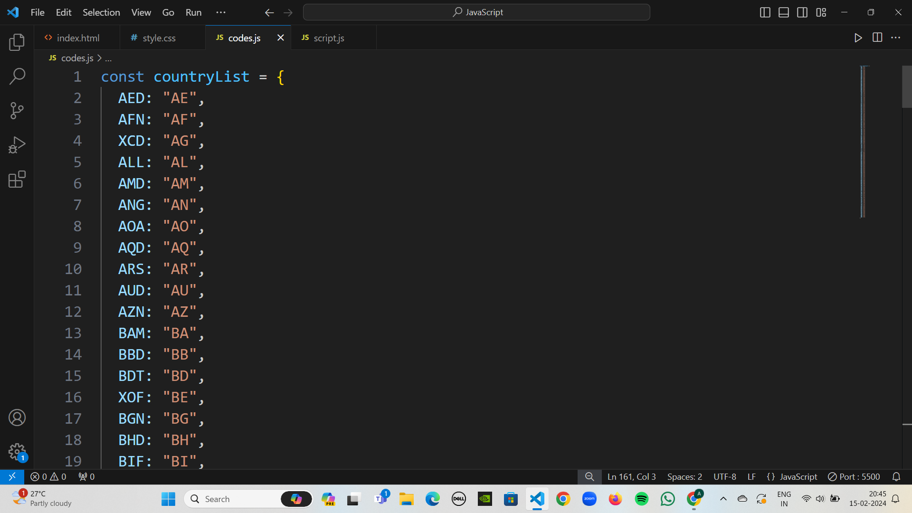
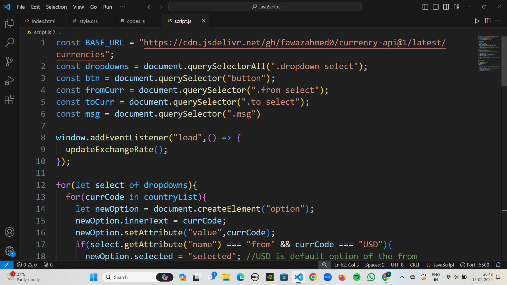

# Live-Currency-Converter
A currency converter made using HTML, CSS and JavaScript.

In this project, I have made a currency converter using HTML, CSS and JS. I have used the currency API with the base URL - https://cdn.jsdelivr.net/gh/fawazahmed0/currency-api@1/latest/currencies and this API fetches the live currency exchange rates of the countries sent in the API request. For example if a request is sent to the API endpoint - https://cdn.jsdelivr.net/gh/fawazahmed0/currency-api@1/latest/currencies/usd/inr.json, then it fetches the exchange rate from USD to INR for a particular date.  
  
To dynamically change the country flags based on the set of countries that the user chooses, I have used flagsAPI - https://flagsapi.com/
<h1>Instructions for using the currency converter</h1>
<ol>
  <li>First, enter the amount you desire to obtain the exchanged value for, in the input box provided.
      
  </li>
  <li>Next, select the <b>from</b> and the <b>to</b> currencies from the currency options provided in the select boxes. For example if you desire to convert from USD to JPY, select the option "USD" in the <b>from</b> select and the option "JPY" in the <b>to</b> select.
      
  </li>
  <li>Next, click on the "Get Exchange Rate" button to get the converted amount.
      
  </li>
  <li>The final converted amount is then displayed along with the corresponding date.
      
  </li>
  <li>It is important to note that the date holds significance as this is a live currency converter and so the exchange rates change with time.</li>
</ol>

<h1>IDE used - Visual Studio Code (VS Code)</h1>
<ul>
  <li>index.html
      
  </li>
  <li>style.css
      
  </li>
  <li>codes.js (Has an object having <code><b>currencyCode : countryCode</b></code> pairs.)
      
  </li>
  <li>script.js
      
  </li>
</ul>
<i><b>So, I really hope that you liked this currency converter!! Thank you for spending your precious time to go throught this project of mine.😊 -Arpan
</b></i>
